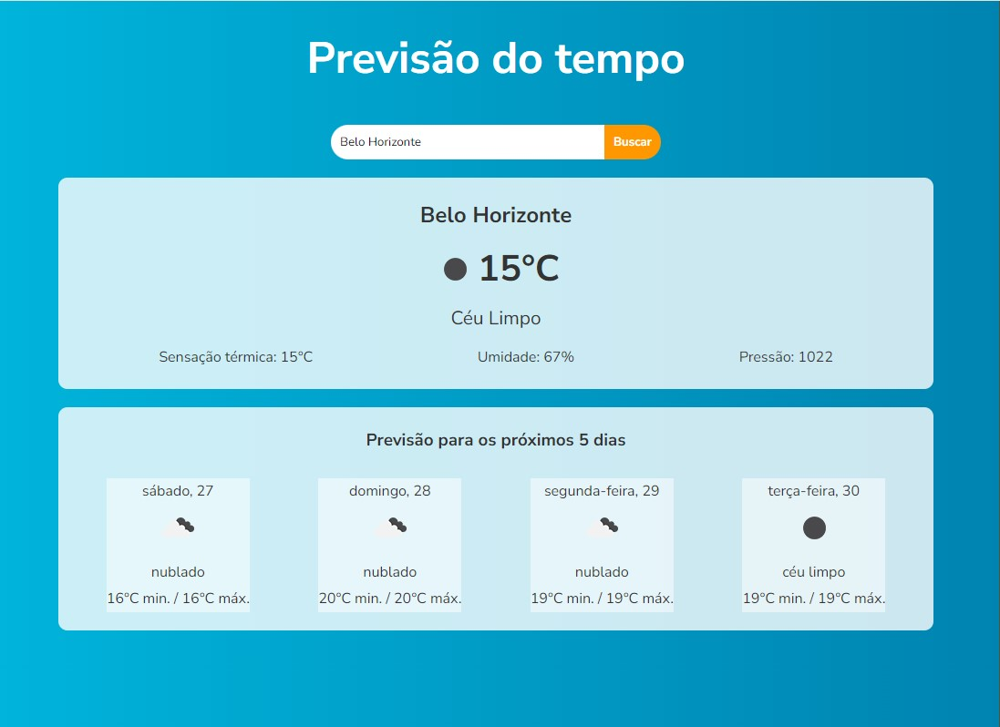

# Consultar previsão do tempo

O objetivo deste projeto é montar um serviço para consulta da previsão do tempo dado um nome de cidade qualquer.

A partir de uma ideia simples, é possível demonstrar:

* consumo de API;
* componetização;
* estilização com CSS

### Funcionamento

O usuário digita o nome da cidade que deseja consulta, o aplicativa faz uma consulta a API OpenWheather e, caso a cidade seja localizada, exibe na tela a condição atual e para os próximos cinco dias.

Trata-se de um projeto para fins didáticos apenas.

